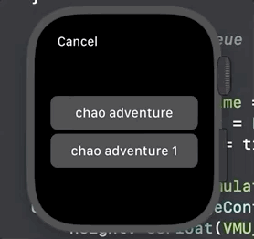

# evmu-watch

  

EVMU Watch is a port of EVMU, a Dreamcast VMU emulator, for the Apple Watch.

## Progression

### Got the emulator running

### First version of Input

### Revised version of Input

### ROM selection

### Palettes

### State Management

